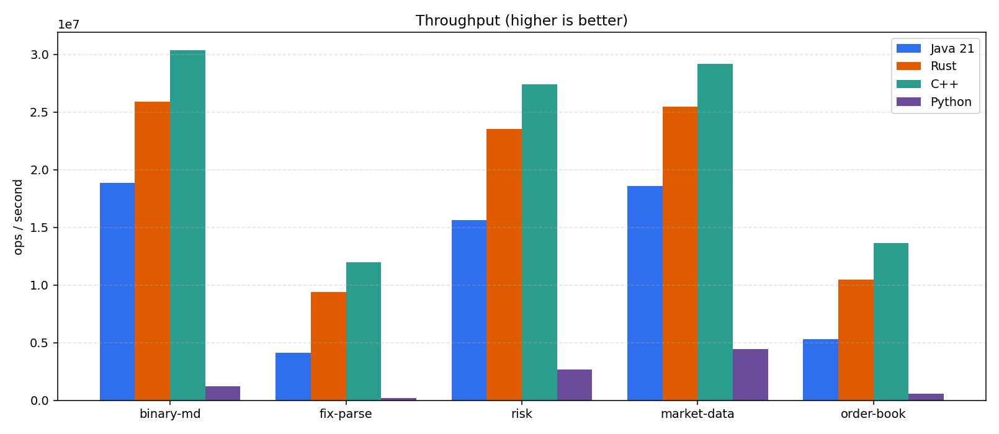
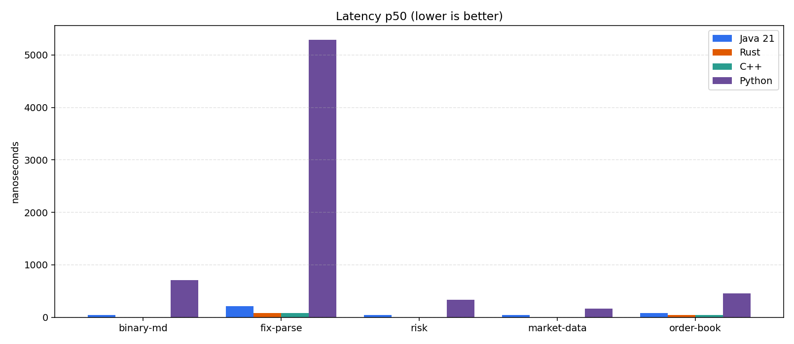
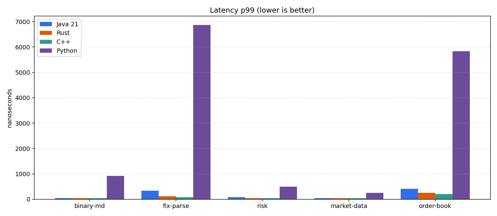

# Equities language benchmark report

Generated **2026-09-20 15:20:08** UTC. Languages: Java 21, Rust, C++, Python.

## Environment

| | Java 21 | Rust | C++ | Python |
|---|---|---|---|---|
| Runtime | OpenJDK 64-Bit Server VM 21.0.12 (21.0.12+8-LTS) | rustc 1.98.1 (48a229cea 2026-09-01) | g++ 12.2.0 (-O3 -flto) | CPython 3.12.14 |
| OS | Ubuntu 22.04.5 LTS | Debian GNU/Linux 12 (bookworm) | linux aarch64 | Linux 6.17.7-300.fc43.aarch64 |
| Arch | aarch64 | aarch64 | aarch64 | aarch64 |
| CPUs | 7 | 7 | 7 | 7 |
| Container | podman | podman | podman | podman |
| CPU | implementer 0x61 part 0x000 | implementer 0x61 part 0x000 | implementer 0x61 part 0x000 | implementer 0x61 part 0x000 |

Host (from runner): `podman podman version 5.8.2` on `Darwin/arm64`.

Checksums **MATCH**.

## Throughput and latency







| Bench | Java 21 ops/s | Rust ops/s | C++ ops/s | Python ops/s | Checksum |
|---|---:|---:|---:|---:|---|
| `binary-md` | 18.85 M | 25.88 M | 30.40 M | 1.25 M | yes |
| `fix-parse` | 4.12 M | 9.40 M | 11.96 M | 177.40 k | yes |
| `risk` | 15.62 M | 23.53 M | 27.40 M | 2.67 M | yes |
| `market-data` | 18.60 M | 25.50 M | 29.18 M | 4.46 M | yes |
| `order-book` | 5.32 M | 10.47 M | 13.66 M | 605.48 k | yes |

Geometric-mean throughput vs Java: Rust / Java: **1.66x**; C++ / Java: **2.01x**; Python / Java: **0.11x**.

## How this run was produced

1. Linux containers for each language (Temurin 21, release Rust, g++ -O3 -flto, CPython 3.12).
2. Same seed, op count, symbols, accounts, and algorithms (`benches/SPEC.md`).
3. Warmup on a throwaway instance, then one measured pass with per-op timers.
4. Single-threaded. This is a language/runtime comparison, not a scaling study.
5. Command: `./run-compose.sh --quick`

## How to rerun

```bash
./run-compose.sh          # 1,000,000 ops (default)
./run-compose.sh --quick  # 100,000 ops smoke run
./run-compose.sh --full   # 2,000,000 ops
./run-compose.sh --cpp-only --python-only
```

Works with Docker or Podman on macOS, Linux, and Windows Git Bash.

## Methodology excerpt

```
# Equities benchmark specification

Java 21, Rust, C++, and CPython implement this spec line-for-line. Timed loops,
PRNG, matching rules, and checksum mixing must match so a checksum mismatch is a
bug, not a language difference.

## Goals

Compare **single-threaded** CPU work typical of an equities trading stack:

| Bench | What it models |
|---|---|
| `order-book` | Price-time matching engine (add / cancel / market) |
| `fix-parse` | FIX 4.4 NewOrderSingle decode (gateway) |
| `risk` | Pre-trade limits: qty, position, notional, price collar |
| `market-data` | Tick aggregation: VWAP + 100-tick OHLC bars |
| `binary-md` | Packed 32-byte tick decode + the same aggregator |

I/O, networking, persistence, and multi-thread scaling are out of scope.

## Fairness rules

- Same seed, op counts, symbols, and accounts.
- Same algorithms and data layout (array-backed book, preallocated orders).
- No allocations on the timed path after setup.
- Per-op `nanoTime` / `Instant::now` around each operation; both languages pay it.
- Checksums printed as **unsigned decimal strings** (JSON numbers lose u64 precision).
- Java: HotSpot 21, G1, fixed heap, `AlwaysPreTouch`.
- Rust: `--release`, thin LTO, `codegen-units = 1`. Default hasher is unused; IDs are dense arrays.
- C++: g++ `-O3 -flto`, C++20, dense arrays / `std::vector`.
- Python: CPython 3.12 (no JIT). Same algorithms; interpreter overhead is part of the result. Python ints wrap with `& (2**64-1)` for checksums.

## Constants

```
PRICE_MIN  = 1
PRICE_MAX  = 20000
PRICE_MID  = 10000
PRICE_SPAN = 200          // generated price = MID + bounded(SPAN) - SPAN/2
MIX        = 1000003      // wrapping u64 checksum mixer
DEFAULT_SEED = 0x0C0FFEE123456789
BUY = 0, SELL = 1
TIF_GTC = 0, TIF_IOC = 1
OP_ADD = 0, OP_CANCEL = 1, OP_MARKET = 2
```

Default CLI: `--ops 1000000 --warmup 50000 --symbols 32 --accounts 256`.

## PRNG

XorShift64 (Marsaglia), 64-bit state, **logical** right shift:

```
x ^= x << 13
x ^= x >> 7     // unsigned
x ^= x << 17
```

If seed is `0`, use `DEFAULT_SEED`. `nextBounded(n)` = unsigned `nextU64() % n` with `n > 0`.

## Workload generation (order-book and risk)

One `XorShift64(seed)`. `nextId` starts at `1`. For each `i in 0..nOps`:

1. `r = nextBounded(100)`
2. If `r < 70` **or** `nextId == 1` → **ADD**
   - `orderId = nextId++`
   - `symbol = nextBounded(nSymbols)`
   - `side = nextBounded(2)`
   - `price = PRICE_MID + nextBounded(PRICE_SPAN) - PRICE_SPAN/2`
   - `qty = 1 + nextBounded(100)`
   - `tif = nextBounded(10) == 0 ? IOC : GTC`
   - `account = nextBounded(nAccounts)`
3. Else if `r < 90` → **CANCEL**
   - `orderId = 1 + nextBounded(nextId - 1)`
   - `account = nextBounded(nAccounts)`
   - other fields 0
4. Else → **MARKET**
   - `orderId = nextId++`
   - `symbol = nextBounded(nSymbols)`
   - `side = nextBounded(2)`
   - `price = 0`
   - `qty = 1 + nextBounded(100)`
   - `tif = IOC`
   - `account = nextBounded(nAccounts)`

RNG call order inside each branch is exactly as listed.

## Order book

One book per symbol. Prices are integers in `[PRICE_MIN, PRICE_MAX]`.

**Layout**

- `orders[id]`: `{symbol, side, price, qty}` — qty `0` means inactive (fill, cancel, or never rested).
- Per book: `levels[price]` = FIFO list of order ids + `totalQty`.
- `bestBid` init `0`, `bestAsk` init `PRICE_MAX + 1`.

**Match** (taker vs opposite side, maker price, price-time / FIFO):

- Buy: while `qty > 0` and `bestAsk <= PRICE_MAX` and `bestAsk <= limitPrice`, hit that ask level.
- Sell: while `qty > 0` and `bestBid >= PRICE_MIN` and `bestBid >= limitPrice`, hit that bid level.
- At a level, scan ids in insertion order; skip `qty == 0`; `fill = min(takerQty, makerQty)`.
- After a level’s `totalQty` hits 0, walk `bestAsk++` / `bestBid--` until a non-empty level or bound.

**Add limit:** match first with `limitPrice = price`. If remainder `> 0` and GTC, rest on the book and update best bid/ask. IOC remainder is discarded (`iocKilled += remainder`).

**Market:** buy limit `PRICE_MAX`,

_(truncated; see benches/SPEC.md)_
```

A p50 of 0 ns means the operation was faster than the container clock (often ~40 ns).
Use throughput for those benches.

These numbers are for this hardware, this container runtime, and this workload.
They are not a universal ranking of the languages.
